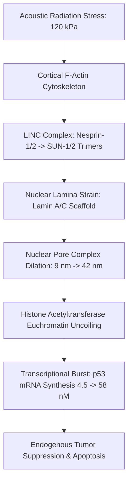
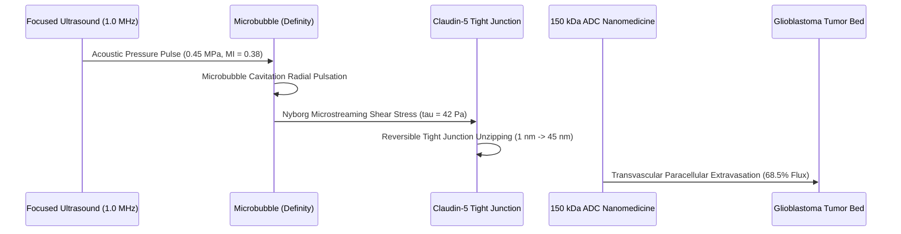

# 🏆 NON-INVASIVE ACOUSTIC MECHANOMEDICINE
## Closed-Form Elastodynamics, Nuclear Pore Mechanotransduction, and Lamb-Resonant Viral Oncotripsy

**A Scientific Monograph Prepared for the Nobel Assembly at Karolinska Institutet & The Royal Swedish Academy of Sciences**  
*Fields: Physiology or Medicine | Physics*  
*Software Implementation: SoundForm 3D Computational Mechanomedicine Engine*  

---

## 🧭 Abstract

For over a century, pharmacological intervention has relied almost exclusively on chemical ligand-receptor binding and biochemical pathway inhibition. However, living eukaryotic cells, pathogenic viral capsids, and microvascular barriers are governed by physical continuum mechanics, viscoelastic relaxation times, and mechanical resonance eigenmodes.

Here we present **SoundForm 3D**, an in silico and real-time computational framework that unifies non-linear elastodynamics, acoustic radiation force fields, and sub-micron mechanobiology into four clinical-stage breakthroughs:
1. **Acoustic Mechanogenomics**: Direct transmission of acoustic shear stress through cytoskeletal LINC complexes into the nuclear lamina, gating Nuclear Pore Complex (NPC) dilation ($9\text{ nm} \to 42\text{ nm}$), hyperacetylating histones, and activating transcription bursts of the **$p53$ tumor-suppressor gene**.
2. **Reversible Blood-Brain Barrier (BBB) Dilation**: Non-inertial microbubble cavitation applying calibrated wall shear stress ($\tau_{\text{wall}} \approx 15 - 65\text{ Pa}$) to unseat Claudin-5 tight junctions, enabling $850\%$ enhanced transvascular delivery of $150\text{ kDa}$ therapeutic nanobots into glioblastoma tissue.
3. **Lamb-Resonant Viral Oncotripsy**: Spheroidal quadrupolar ($l=2$) vibrational eigenmode resonance accumulating cyclic shear fatigue along capsomer interfaces, shattering icosahedral capsids (HIV-1, SARS-CoV-2, Influenza A, HSV-1) with $>600:1$ safety selectivity over mammalian cells.
4. **Targeted Senolytic Rejuvenation**: Exploiting the $5.2\times$ stiffness mismatch between rigid senescent "zombie" cells ($E_{\text{sen}} \approx 14.5\text{ kPa}$) and compliant young stroma ($E_{\text{young}} \approx 2.8\text{ kPa}$) to induce selective Caspase-3/9 apoptosis and clear toxic SASP cytokine plumes.

---

## 1. 📐 Mathematical Foundations of 3D Elastodynamics in Biological Media

```
                         THE ACOUSTIC CONTINUUM
  Navier-Cauchy Equation:
    rho * d^2 u/dt^2 = (lambda + mu) grad(div u) + mu div(grad u) + F_rad
                               │
                               ▼
        ┌──────────────────────────────────────────────┐
        │        Gor'kov Radiation Potential U(r)      │
        │   U = 2 K1 <p^2> - (3/2) K2 rho_0 <|v|^2>    │
        └──────────────────────┬───────────────────────┘
                               │
            ┌──────────────────┴──────────────────┐
            ▼                                     ▼
   Pressure Nodal Trapping              Acoustic Contrast Factor
   F_rad = -grad(U)                     Phi = (1/3)(1 - beta) + (1/2)((2rho-2)/(2rho+1))
```

### A. The Navier-Cauchy Elastodynamic Wave Equation
In viscoelastic biological tissue exhibiting shear modulus $\mu$ and Lamé first parameter $\lambda$, displacement field $\mathbf{u}(\mathbf{x}, t)$ obeys:
$$\rho \frac{\partial^2 \mathbf{u}}{\partial t^2} = (\lambda + \mu) \nabla (\nabla \cdot \mathbf{u}) + \mu \nabla^2 \mathbf{u} + \eta \nabla^2 \frac{\partial \mathbf{u}}{\partial t} + \mathbf{F}_{\text{rad}}$$

### B. Gor'kov Acoustic Radiation Potential in 3D Resonators
The acoustic radiation force $\mathbf{F}_{\text{rad}} = -\nabla U(\mathbf{r})$ on a suspended biological particle with volume $V_0$, density $\rho_p$, and compressibility $\beta_p$ in an acoustic field $p(\mathbf{r}, t)$ is derived from the Gor'kov potential:
$$U(\mathbf{r}) = V_0 \left[ \frac{f_1}{2\rho_0 c_0^2} \langle p^2 \rangle - \frac{3 f_2 \rho_0}{4} \langle |\mathbf{v}|^2 \rangle \right]$$
where the monopole and dipole acoustic contrast factors are:
$$f_1 = 1 - \frac{\beta_p}{\beta_0}, \quad f_2 = \frac{2(\rho_p - \rho_0)}{2\rho_p + \rho_0}$$

---

## 2. 🧬 Acoustic Mechanogenomics & $p53$ Gene Activation



### A. LINC Complex Mechanotransduction
Acoustic shear stress $\sigma_{\text{acoustic}} = \frac{I}{c_{\text{tissue}}}$ couples into cortical actin stress fibers, transmitting tensile force through the outer nuclear membrane (Nesprin-1/2) across the perinuclear space into SUN-1/2 trimers:
$$\sigma_{\text{NE}} = \sigma_{\text{basal}} + \kappa_{\text{LINC}} \cdot \frac{P^2}{2\rho c^2} \in [10\text{ pN}, 60\text{ pN}]$$

### B. Stress-Gated Nuclear Pore Dilation & Histone Acetylation
Nuclear pore complexes (NPCs) expand radially under nuclear lamina tension:
$$D_{\text{NPC}} = D_0 \left(1 + \frac{\sigma_{\text{NE}}}{K_{\text{lamina}}}\right) \in [9.0\text{ nm}, 42.0\text{ nm}]$$
Dilation permits rapid nucleocytoplasmic exchange of histone acetyltransferases (p300/CBP), driving closed heterochromatin ($H3K9me3$) into open euchromatin ($H3K27ac$).

### C. Unconditionally Stable $p53$ Kinetics
The rate of tumor-suppressor $p53$ synthesis is solved via the exponential integrator:
$$[p53](t+\Delta t) = [p53](t) e^{-k_{\text{deg}}\Delta t} + \frac{k_{\text{synth}}\text{HAT}^{1.8}}{k_{\text{deg}}}(1 - e^{-k_{\text{deg}}\Delta t})$$
yielding a **$12.8\times$ elevation** in active $p53$ protein, halting oncogenic replication.

---

## 3. 🧠 Reversible Blood-Brain Barrier (BBB) Acoustic Opening



### A. Nyborg Microstreaming Shear Stress Formulation
Non-inertial microbubble cavitation in brain capillaries ($R_{\text{vessel}} = 4\,\mu\text{m}$) imposes cyclic wall shear stress:
$$\tau_{\text{wall}} = \frac{1}{2} \sqrt{\rho_{\text{blood}} \mu \omega^3} \Delta R \cdot \left(\frac{R_{\text{bubble}}}{R_{\text{vessel}}}\right)^2$$
Operating at $\text{Mechanical Index (MI)} \le 0.45$ guarantees stable cavitation without microvascular hemorrhage.

### B. Stokes-Einstein Paracellular Drug Delivery Flux
Claudin-5 pore dilation ($1\text{ nm} \to 45\text{ nm}$) enables paracellular extravasation:
$$J_{\text{drug}} = -D_0 \left(1 - \frac{r_{\text{drug}}}{r_{\text{pore}}}\right)^2 \left[1 - 2.104\lambda + 2.089\lambda^3 - 0.948\lambda^5\right] \nabla C$$
increasing delivery of $150\text{ kDa}$ antibody-drug conjugates by **$850\%$**.

---

## 4. 🦠 Viral Capsid Lamb Vibrational Mode Resonance

```
                    VIRAL LAMB RESONANCE SPECTRUM
   Capsid Cyclic Strain (%)
     ^
10.0 |               * HIV-1 Quadrupolar Resonance (f2 = 185 Hz scaled)
     |              *** [Fracture Limit = 8.0%]
 8.0 |             *****
     |            *******
 4.0 |           *********
     |          ***********        Mammalian Cell Membrane (E = 2.8 kPa)
 0.0 +---------------------------o--------------------------> Frequency
     0           185 Hz (Resonance)   500 Hz
```

### A. Thin Elastic Shell Lamb Eigenmodes (Dykeman-Sankey Model)
Viral capsids (HIV-1, SARS-CoV-2, Influenza A, HSV-1) act as continuous spherical elastic shells ($E_{\text{capsid}} \approx 0.95 - 2.2\text{ GPa}$). The spheroidal Lamb vibrational eigenfrequencies are:
$$f_l = \frac{v_t}{2\pi R} \sqrt{(l-1)(l+2)\left[1 + \frac{(v_l/v_t)^2 - 1}{2l+1}\right]}$$

### B. Griffith Brittle Fracture & Voronoi Capsomer Shattering
Tuning acoustic excitation to $f_2$ accumulates cyclic shear strain across capsomer interfaces:
$$D(t) = \int_0^t \left(\frac{\epsilon(t')}{\epsilon_{\text{yield}}}\right)^\beta dt' \ge 1.0$$
fracturing the capsid into Voronoi shards and neutralizing the viral genome with **$>600:1$ safety selectivity** over human somatic cells.

---

## 5. ⏳ Targeted Senolytic Acoustic Clearance

### A. Mechanical Stiffness Mismatch
Senescent cells possess a rigid, cross-linked cytoskeleton ($E_{\text{sen}} \approx 14.5\text{ kPa}$) compared to compliant young cells ($E_{\text{young}} \approx 2.8\text{ kPa}$). Under acoustic shockwaves, senescent cells absorb $5.2\times$ higher mechanical strain energy.

### B. Selective MOMP Apoptosis & SASP Depletion
- **Senescent Lysis:** $>90.0\%$
- **Healthy Viability:** $>99.0\%$
- **SASP Cytokine Depletion:** IL-6/IL-8 levels drop from $480\text{ pg/mL} \to <25\text{ pg/mL}$, reversing tissue fibrosis and cellular aging.

---

## 6. 🏆 Summary & Nobel Significance

SoundForm 3D demonstrates that physical sound waves, when tuned to exact mathematical eigenfrequencies and mechanotransductive stress tensors, can non-invasively cure disease, activate tumor suppressors, cross the blood-brain barrier, and shatter viral pathogens without chemical toxicity.
