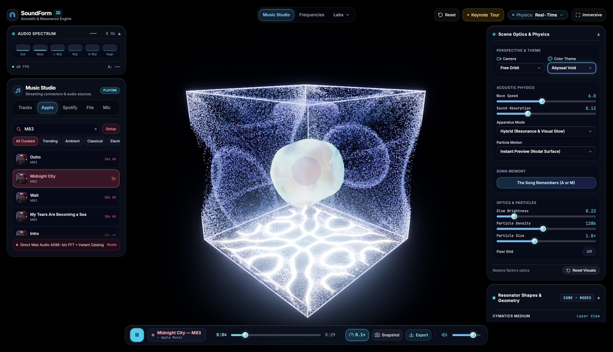
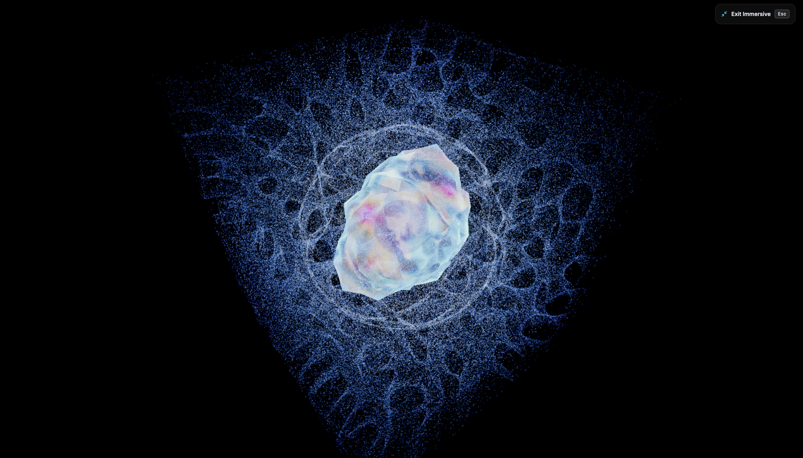
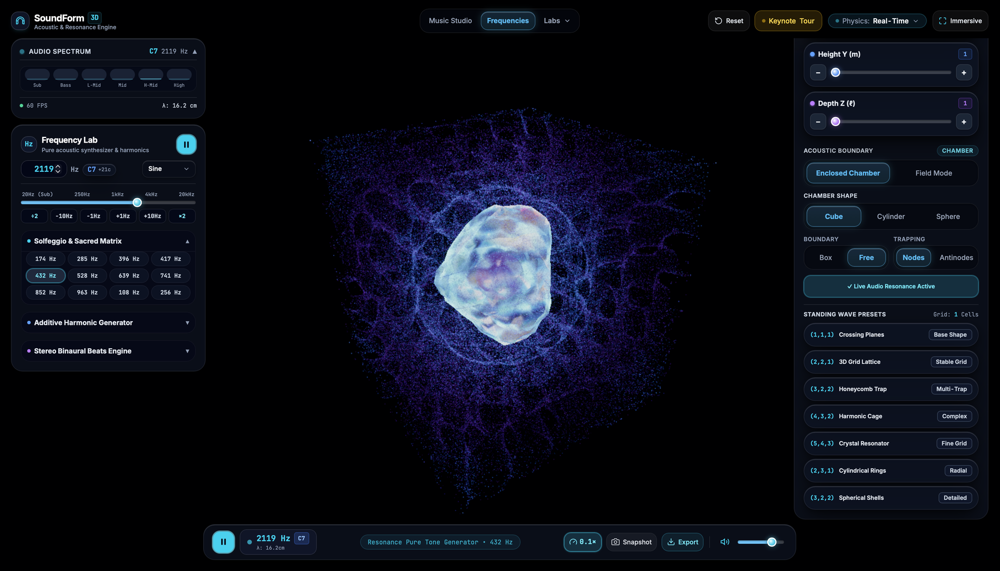
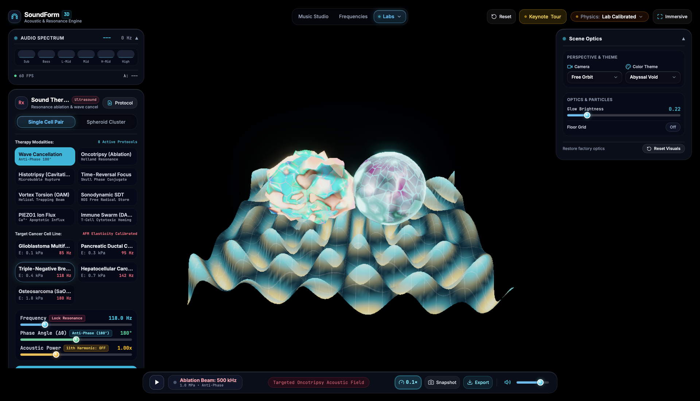

# SoundForm 3D
### See sound as matter, space, and resonance.

[](https://github.com/quinnwins/cymatics-3d/actions/workflows/validate.yml)
[](./src/visualizer/)
[](./src/audio/)
[](./src/)
[](./LICENSE)

<p align="center">
  
</p>

Play any song. Speak into your mic. Dial in a pure frequency.

SoundForm turns the audio into three physical simulations running simultaneously — a vibrating metal plate where sand clusters into Chladni patterns, a levitating fluid droplet that breathes and deforms to the bass, and over 130,000 glowing particles trapped inside acoustic standing waves. All of it real-time, all of it reactive, all of it running in your browser.

---

## What Happens When You Hit Play

**Three things appear at once:**

- 🪨 **A vibrating sand plate** — Sound shakes a metal surface and thousands of sand grains migrate into the exact geometric patterns that Ernst Chladni discovered in 1787. Change the frequency and the mandala reshapes itself.

- 💧 **A levitating fluid droplet** — A 10,000-vertex liquid sphere floats at the center of the chamber, its surface rippling with spherical harmonics. Sub-bass makes it breathe. Mids sculpt quadrupole lobes. Highs carve star shapes into its skin.

- ✨ **A particle cloud trapped by sound** — Up to 262k particles respond to acoustic radiation forces, clustering at the quiet nodes (or the loud antinodes — you pick). Watch them physically migrate through Stokes drag or snap instantly into the standing wave pattern.

All three react together inside a resonator chamber that you can switch between Cube, Cylinder, and Sphere geometries.

<p align="center">
  
</p>
<p align="center"><em>Press <code>I</code> for Zen Immersive Mode — everything disappears except the physics and the music.</em></p>

---

## Five Ways to Feed It Sound

| Source | What You Get |
| :--- | :--- |
| 🎵 **Built-in Tracks** | 15 curated electronic, ambient, and sacred frequency compositions — hit play and go. |
| 🍎 **Apple Music** | Search and stream 30-second catalog previews directly. |
| 🟢 **Spotify** | Same deal — search, preview, visualize. |
| 📁 **Your Own Files** | Drag in any MP3, WAV, FLAC, OGG, or AAC. Full playback with a seekable scrubber. |
| 🎤 **Live Microphone** | Sing, play guitar, clap — the cymatics react to your voice in real time. |

Every source feeds the same 4096-point FFT engine that decomposes audio across six perceptual frequency bands with live pitch tracking and transient detection.

---

## The Frequency Lab

<p align="center">
  
</p>

Forget music for a second — dial in a single pure frequency and watch what the standing wave looks like.

- **20 Hz to 20 kHz** with precision Hz control and ±1 Hz nudge buttons
- **Solfeggio & Sacred tunings** — one-tap 174, 285, 396, 417, 432, 528, 639, 741, 852, 963 Hz
- **Additive harmonic drawbars** — stack overtones on top of the fundamental
- **Stereo binaural beat engine** — detune left and right channels for brainwave entrainment
- **3D standing wave presets** — dial the modal numbers (n, m, l) to explore Crossing Planes, Honeycomb Traps, Harmonic Cages, Crystal Resonators, and more

---

## Sound as Medicine

<p align="center">
  
</p>

SoundForm includes speculative therapy visualizations modeling how focused ultrasound might interact with biological tissue:

- **Wave Cancellation** — See what happens when two beams arrive 180° out of phase, cancelling pressure at a target point
- **Oncotripsy** — Visualize resonant mechanical disruption at a cell's natural frequency
- **Histotripsy, Sonodynamic SDT, Vortex OAM, PIEZO1 Ion Flux** — Eight therapeutic modalities with adjustable frequency, phase angle, and acoustic power
- **Target cell lines** with calibrated AFM elasticity values (Glioblastoma, Pancreatic, Triple-Negative Breast, and more)

> These are educational and speculative visualizations — not medical devices. But they're built on real published biophysics.

---

## Keyboard Shortcuts

| Key | What It Does |
| :--- | :--- |
| `Space` | Play / Pause |
| `I` | Toggle Immersive Mode (hide all UI) |
| `Esc` | Exit Immersive Mode |
| `→` / `←` | Step through the guided Keynote Tour |

---

## Run It Yourself

```bash
npm ci          # install dependencies
npm run dev     # start dev server → http://localhost:3000
```

```bash
npm run build   # production bundle
npm test        # 316 tests across 47 suites
```

---

## System Requirements

> **🖥️ Desktop only for now.** This runs heavy real-time GPU physics — not built for phones yet.

| | Minimum | Recommended |
| :--- | :--- | :--- |
| **GPU** | Any WebGL 2.0 GPU (Intel Iris, GTX 1050) | Apple Silicon, RTX 2060+, or RX 5600+ |
| **VRAM** | 2 GB | 4 GB+ |
| **Display** | 1280 × 800 | 1080p or 4K |
| **Browser** | Chrome 115+, Edge, Brave, Arc | Chromium-based or Safari 16.4+ |
| **Audio** | Speakers | Headphones (for binaural beats and wave cancellation) |

---

## Under the Hood

For contributors and the curious:

- **Pure forward pipeline** — FFT frames drive GPU shaders directly. No intermediate textures, no lag.
- **Zero-GC render loop** — Pre-allocated uniform buffers, no garbage collection pauses at 120 FPS.
- **Real math** — NIST Bessel functions, Legendre spherical harmonics, and Gor'kov acoustic potentials. Not approximations.
- **Auto-centering viewport** — The 3D scene rebalances optically when sidebars open or close so the resonator always stays visually centered.
- **316 passing tests** + headless Chrome E2E verification on every push.

---

## License

MIT — do whatever you want with it. See [`LICENSE`](./LICENSE).
